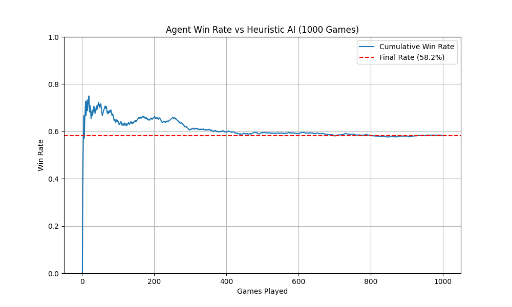
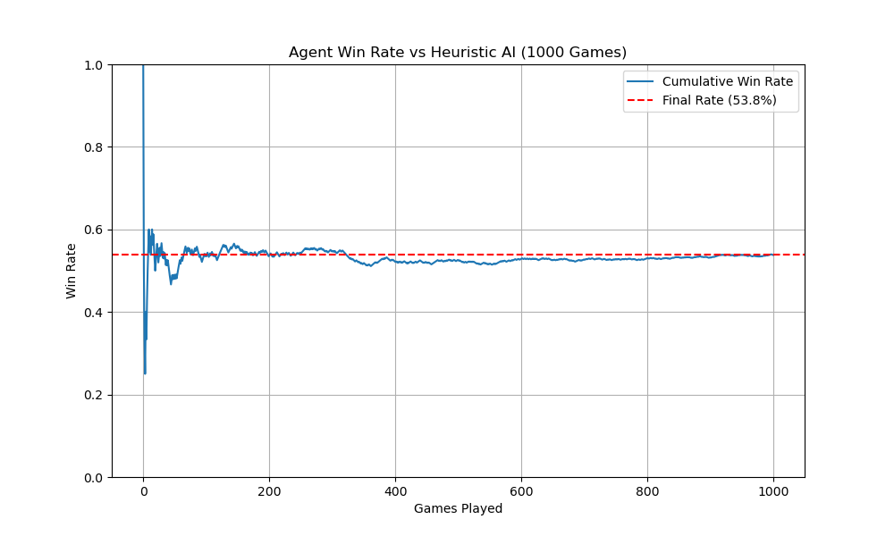
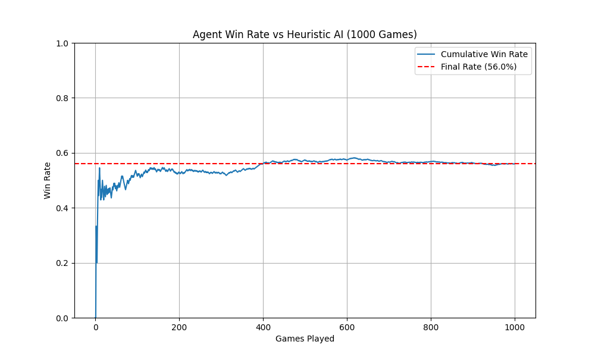
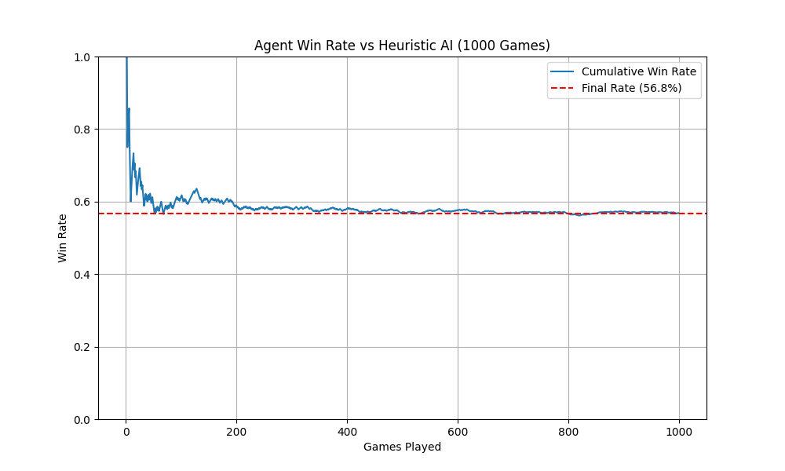
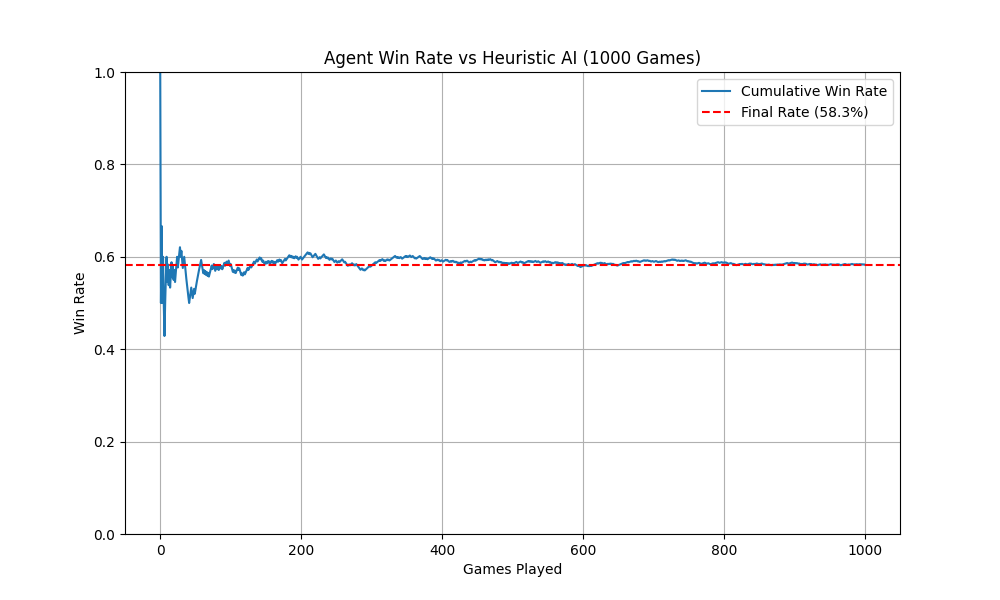
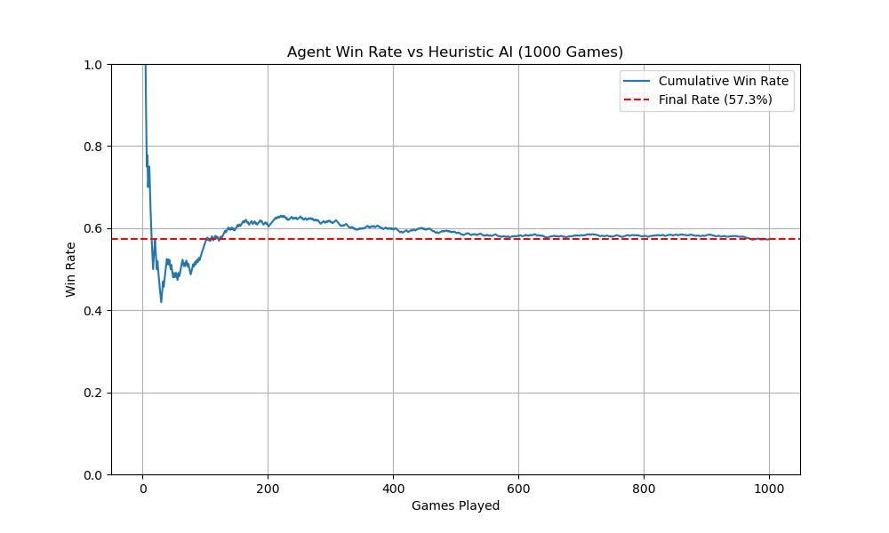
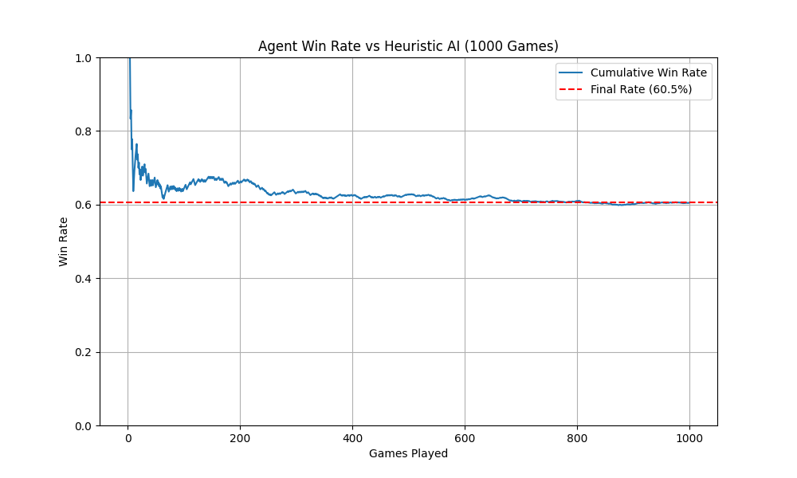
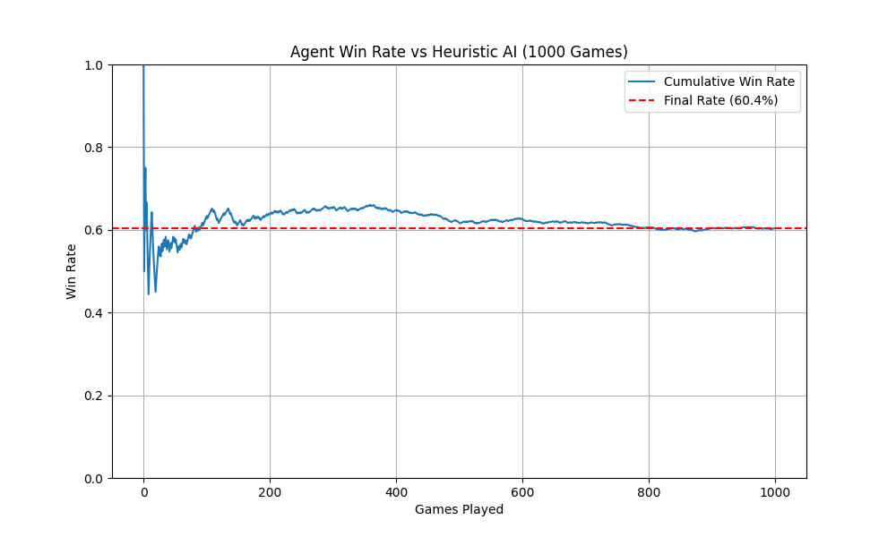

# Catan AI

This project implements AI agents for Settlers of Catan using Reinforcement Learning techniques. We compare a HeuristicAIPlayer (Greedy) vs. Q-Learning vs. DQN

## Packages to install 

Q-Learning: matplotlib, numpy, pygame
DQN: tensorflow, tqdm, ? TODO

## Q-Learning
The Q-Learning agent uses Q-learning with a linear approimator to choose where to place roads, while keeping everything else the same within HeuristicAIPlayer. The agent is also trained against the HeuristicAIPlayer, and is able to achieve 57.2% winrate (over 10,000 games) after training for 2,000 games. 

## Deep Q-Network (DQN)

The DQN agent uses a neural network to approximate the Q-value function, allowing it to handle the large state space of Catan. The agent is trained against the HeuristicAIPlayer. The performance ranges from low 50s to 60 depending on how many episodes it was trained for. The difference between the HeuristicAIPlayer and the DQN agent is that instead of choosing random roads, settlements, cities to build it picks a specific location. In the end, the agent seemed to only be able to win 60% of the time compared to the greedy HeuristicAIPlayer. 

### Results Analysis

We benchmarked the DQN agent's performance at various training milestones. The following graphs show the win rate and average victory points over time.

#### Early Training (660 - 1800 Episodes)
In the early stages, the agent quickly gets up to around 55%. 

*Results after 660 episodes*

*Results after 1000 episodes*

*Results after 1800 episodes*

#### Mid-Training (2500 - 2940 Episodes)
As training progresses, we can observe changes in the agent's performance and strategy stability. It gets up to 60% but hovers around 58%

*Results after 2500 episodes*

*Results after 2670 episodes*

*Results after 2940 episodes*

#### Extended Training (4000 - 5310 Episodes)
Finally, it gets to around 60% and stays there. Sometimes it dips to around 58%, but most times will get 60%

*Results after 4000 episodes*

*Results after 5310 episodes*

*Results after 6360 episodes*

### Gameplay Demos

Watch the agent in action:

- [Winning Game Playthrough 1](https://youtu.be/Afzk3vF0z_4)
- [Winning Game Playthrough 2](https://youtu.be/7l6M2oHQ1Y8)

### Discussion
Some issues I faced were hyperparameter tuning for what n and m should be, what gamma should be, and what the rewards should look like. I tried an n and m of 2 and 10, 3 and 50, 4 and 15, but ultimately 5 and 30 tended to perform the best. I also struggled with what epsilon decay should be. I had to move it up to 0.999 from 0.99 and 0.996 because the model would set on a pretty bad strategy and hover around 54% performance. For gamma and rewards, I initially had it as 0.95 and had rewards for building settlements, roads, and cities. But because of this it would just build roads and take the immediate reward. This led to it hovering around 57-58% for performance.

It was interesting to play around with DQN
